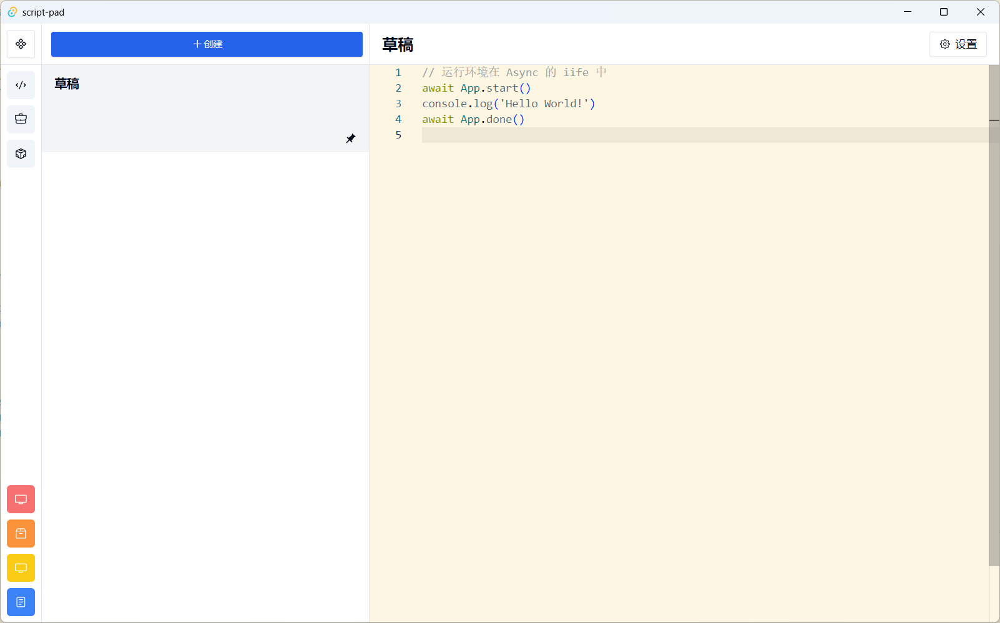
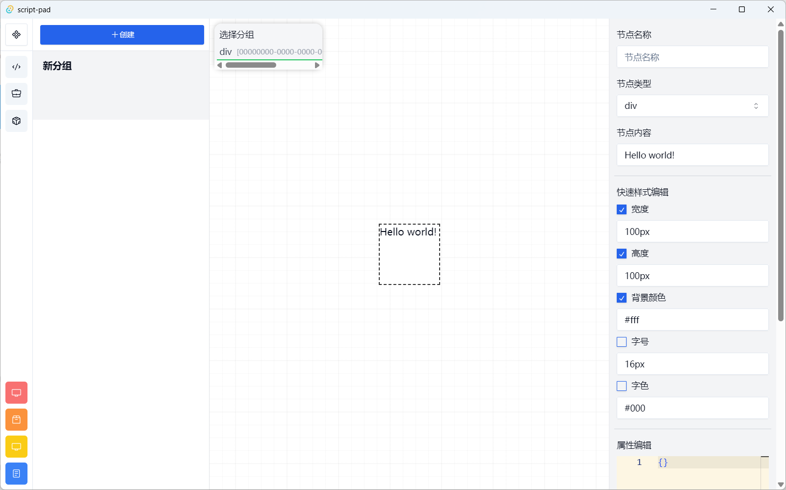

# Script Pad

## 这是什么？
这个工具就是拿来运行脚本的，里面有一些我用的比较熟悉的 API，在 `src\vm\modules` 中，API 的文档在[这里](https://erioifpud.github.io/script-pad-docs/)，更新应该**不及时**。

简单来说就是个（半）**自动化工具**吧，有些时候我有了灵感就想要去实践，但是新建一个项目、安装依赖、配置等实在是太麻烦了，所以这玩意就诞生了。

低代码编辑器是后来拍脑袋的想法（尤其是**列表**和**隐藏**功能，写完了才临时加的），所以他看起来很简陋，但它还蛮好用的，省去不少在脚本中写纯组件的麻烦。

使用 [Tauri](https://tauri.app/) 构建，所以你可以在 Windows、MacOS 和 Linux 上运行，不过我还没测试过后两个平台。

## 运行
### 开发
1. 安装 [Rust](https://www.rust-lang.org/zh-CN/install)
2. 安装 [Node.js](https://nodejs.org/zh-cn/download/)
3. 使用包管理器 `pnpm` 安装项目的依赖
4. 运行 `pnpm tauri dev`

### 部署
同上，后运行 `pnpm tauri build`。

## 未来规划
- [ ] 添加更多 API（主要还是按个人需求）
- [ ] 去除一些毫无意义的 API（如 `App.show`）
- [ ] 使用 embedding deno 代替 iframe 沙箱，这样应该可以更快，而且支持用多线程做管理（遇到了技术难题）
- [ ] 去除一些冗余代码（目前脚本和文档页面挺像的，所以有些冗余代码，但这部分应该不需要合并）
- [ ] 升级到 React 19
- [ ] 完善低代码编辑器
- [ ] 数据备份（目前只会打开数据目录，自己备份）
- [x] 通过 HTTP 请求调用脚本（目前只支持本地调用且端口固定在 56789）